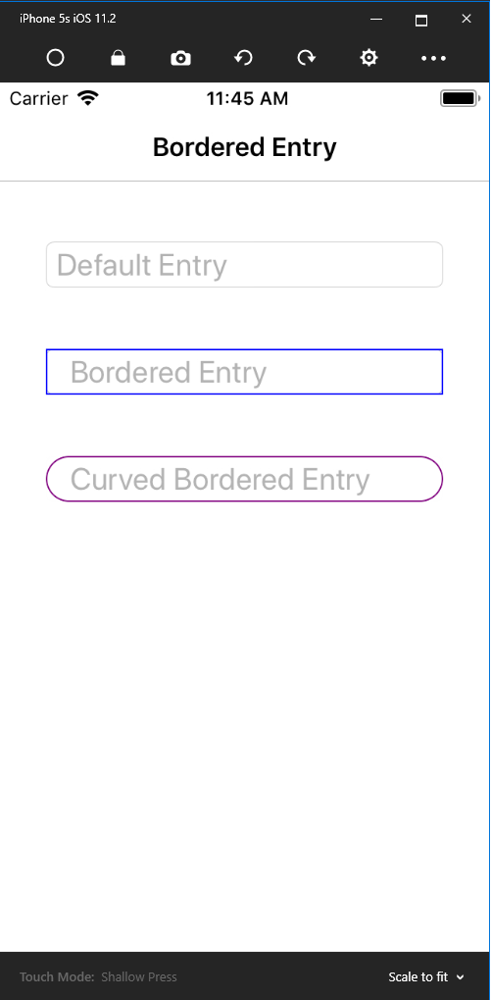
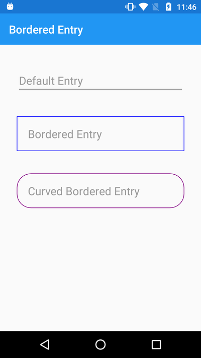

# xamarin-bordered-entry
This repository helps to design bordered and curved entry in xamarin forms in MVVM architecture. 

# Introduction
When you have to desing bordered or curved entry then it will help alot. This project is created in MVVM architecture. We have achieved bordered and curved entry by creating custome renderer.

# screenshot-iOS

# screenshot-android

